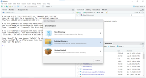
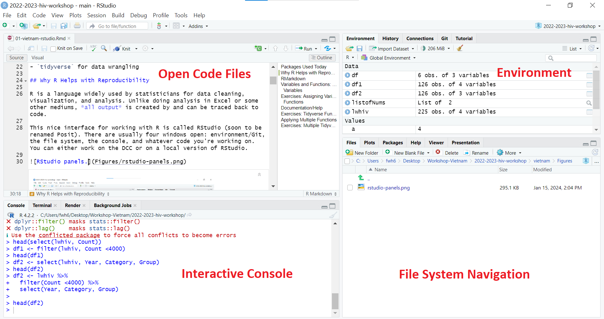

```{r setup, include=FALSE}
knitr::opts_chunk$set(echo = TRUE, warning=FALSE)

```

Welcome to the preliminary coding workshops on Quantitative Methods for HIV Researchers (Rishi will send title)! These lectures will serve as code introductions and guides for the in-person portion of the workshop since data analysis and programming will not be covered in the in-person workshops. I will start each of these lectures with a list of packages used and concepts these packages are relevant for.

Today, we will go over tools to enable reproducible research in medicine, and we'll talk about basic programming.

# Packages Used Today

- base R (loaded by default and used for any coding in R)
- `tidyverse` for data wrangling

# Reproducibility

Reproducibility in medical research is crucial for ensuring the reliability and validity of scientific findings. Nowadays, this entails being able to provide code that reproduces the same results and figures that you report. 

R/RStudio is an open-source programming language and interface which is used widely in data science.

# Setting up an RStudio Project

We will walk through how to start a project in R Studio, using the workshop material available in this Box folder: TBD. 

1. Download the zipped folder and unzip it, saving it in a location you'll remember.
2. Open RStudio and navigate to File > New Project. Click on Existing Directory.



3. In the file navigator pop-up, find your unzipped files. Click Ok.

You should now see 


# RStudio

## Why R Helps with Reproducibility

R is a language widely used by statisticians for data cleaning, visualization, and analysis. Unlike doing analysis in Excel or some other mediums, *all output* is created by and can be traced back to code.

This nice interface for working with R is called RStudio (soon to be renamed Posit). There are usually four windows open: environment/Git, the file system, the console, and whatever code you're working on. You can either work on the DCC or on a local version of RStudio.



- Open Code Files: we will edit scripts and RMarkdown files here.
- Environment: objects (i.e. dataframes) that we create will show up here. There is also a Git tab for easy version control.
- File System Navigation: we use this like a normal file system navigator.
- Console: for running interactive code; doesn't save any code input here once session ends.

## RMarkdown

RMarkdown (RMD) is a special type of file that can be created in RStudio. It can integrate R code with plain text to run/document analysis and create reports. 

Plain text can be edited directly in the source file or in visual mode (click on the drop down settings button next to "Knit"). Headers are denoted with hash tags; use more hash tags to denote subheaders or subsections. We can make bullet points as follows:

-   type a dash in a new line
-   press enter
-   and make sure you have a space between the dash and your bullet point content

Code goes in special sections called chunks, and we can format plain text using markdown commands or the visual tab. We can even put in-line code in plain text. For example, today is `r Sys.Date()`.

The shortcut on windows for a code chunk is "r - Shift -Tab". In the below code chunks, we write some code and R evaluates and prints output.

```{r division}
8/4
```

```{r printingHi}
print("Hi! Welcome to RMarkdown.")
2+1
```

Copy and paste the above commands in your console and run, just to get a sense of what it does.


# Variables and Functions: the Syntax of Programs

#### Variables

R is a program, and like other programming languages, we can think of it as a language. We refer to **objects** like datasets or values using aliases, or **variables**. Using the language analogy, objects are nouns and variables are names. We assign variable names to objects using the <- operator. Unlike objects in real life, programming objects have a limited number of strict structures (**types**) associated with them (a number, a string, a list, a dataframe, etc.).

Below, we make a variable $a$ and set it equal to numeric object 4, and then we make a variable $df$ and set it equal to a data frame object with 3 columns (name, arm, and viral load). Note that after assignment, Rstudio's `Environment` tab shows the names and their associated values. We can refererence these variables by their names in the console and any chunk or inline code after the assignment chunk. The `History` tab shows all the commands that have been executed in this session.

```{r var-ex, options}
# we store the value "4" in the variable a
a <- (5+3)/2

# we store a data frame (6x3) with information on names, treatment arm, viral load
df <- data.frame(name=c("Participant 1", "Participant 2", "Participant 3", "Participant 4", "Participant 5", "Participant 6"),
                 arm = c("A", "B", "B", "B", "A", "A"),
                 viralload = c(0.1, 1.5, 0.6, 2, 0.4, 0.5))
```


There are different types of variables; we've already seen a numeric variable ($a$) and a data frame variable ($df$). Here are a few common ones:

- *numeric* <br>
  In R, this includes both floating points (decimal) and integers (e.g. 1.2, 3.14159, 15)
  
- *integer* <br>
  Non-floating point number (e.g. 1, 2, -4, etc., but not 1.2, 3.14159,...)

- *logical* <br>
  TRUE or FALSE
  
- *character* <br>
  Words and letters. NB: numbers can be treated as characters too - we'll do some examples that illustrate that.
  
- *factor* <br>
  A variable that can only take a finite number of values. For example, we could have the variable `eye_color`, that can be blue, brown, hazel or green.

In R, these are 'atomic' types (also called atomic *vectors*, because in R, a single element is a vector of length 1). Classes (higher order structures) can be created from these basic classes:

- *vector* <br>
  A one-dimensional array with elements of one atomic type (a 1xn matrix).
  
- *list* <br>
   Like a vector, but elements can be *anything* (combination of types is allowed), even other lists. 
   
- *dataframe* <br>
   A 2-dimensional array that allows columns to be different types. All columns must have the same length <br><br>
   
When you assign values to variables, R will usually guess correctly what type the variable is. For example, let's read in a CSV file and store as variable lwhiv. R knows that `lwhiv` is a data frame.

```{r lwhiv, options}
lwhiv <- read.csv("Data/persons-living-with-hiv-aids.csv")

head(lwhiv)
```

However, you can also explicitly tell R what type you want the variable to be.

```{r typing, options}
# 4.2 as a numeric, character, integer, and factor type
(b <- 4.2)
(b <- as.character(4.2))
(b <- as.integer(4.2))
(b <- as.factor(4.2))
```

### Exercises: Assigning Variables

1. **Vectors** <br>
   Create 2 numeric vectors of length 10 and assign them to variable names. The first vector should be the first 10 even numbers. The second vector should be the numbers 1-10. (If you're familiar with R already, use the function `seq` to generate the first vector.)
   
```{r exVec, options}
evenNums <- seq(2, 20, by=2)
firstTenNums <- 1:10
```
 
3. **Lists**
Create a list of length 2 containing the two above sequences as elements, then create a vector which consists of the concatenated sequences.

```{r exList, options}
# the below two things are structurally different though they contain the same numbers
listofNums <- list(evenNums, firstTenNums)
vectorofNums <- c(evenNums, firstTenNums)
```

4. **Dataframes** 
Create a dataframe with 5 rows and 3 columns. The first column should be characters, the second column should be numeric, and the last column should be factors. 

```{r exDF, options}
head(lwhiv, n = 15)
```


#### Functions

We can do things to these variables or objects using simple operators or more complex functions. In the language analogy, operators and functions are verbs. For example, we can add 4 to each entry in vector of numbers using the operator `+`:

```{r add, options}
# add 4 to (2, 5, 3)
c(2,5,3) + 4

```

For more complex functions, we can either write our own function or use built-in functions from the R ecosystem. These functions require inputs, or **arguments**, through which you give R information on what to apply the function to and how to do it. A function returns a **value**, an object that we can assign to a variable name. We oftentimes import additional libraries (also called packages) to use functions beyond what base R gives us. One that we'll be using during this workshop is the tidyverse set of packages.

## Installing and Loading Packages

We can install and load packages inside a code chunk in RMarkdown. Usually, this chunk would be towards the beginning of the RMarkdown.

```{r libs, options}
library(tidyverse)
```
# Tidyverse Functions

Below, here are some tidyverse functions we'll be covering today:

- head: looks at the first $n$ rows of a dataframe
- select: isolate dataframe columns based on column name or condition
- filter: isolate dataframe rows based on a condition
- arrange: arrange a dataframe by a column

Recall that we previously loaded in a dataset `lwhiv`.

Below, We use the `head` function to only look at the first 6 rows of the dataframe. We also use the function `select` to isolate the "Group" and "Count" columns from lwhiv. 

```{r basic-tidyr, options}
head(lwhiv)

select(.data=lwhiv, 
            Group, Count)
```


## Documentation/Help

There are several resources for R commands. Say you are unsure what the function `mutate` from the `tidyverse` package does. Any one of the following are valid ways of getting help:


-   in the console, type `?mutate` and the documentation page will show up in the help window
    -   arguments: lists which arguments are necessary for the user to specify
    -   values: lists what the function outputs
    -   examples: provides example code that the user can run in the console
-   search for the function online; there will be a documentation page accessible via browser as well as potentially other examples and explanations on blogs, papers, etc.

### Exercises: Tidyverse Functions 

1. Look up the `tidyverse` function `filter`. What does it do and what arguments does it need? Copy + paste and play with one of the examples to see what it does.
2. From the lwhiv, use `filter` to keep only observations with from the year 2015. 
3. Save this dataset to the variable name `lwhiv2015`.

## End of Coding Session

Make sure you save your RMD. 

